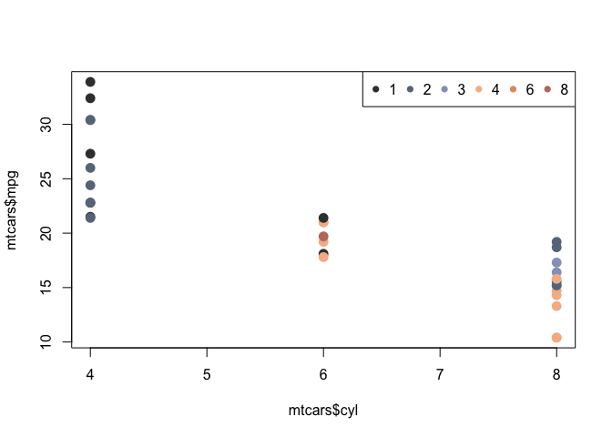
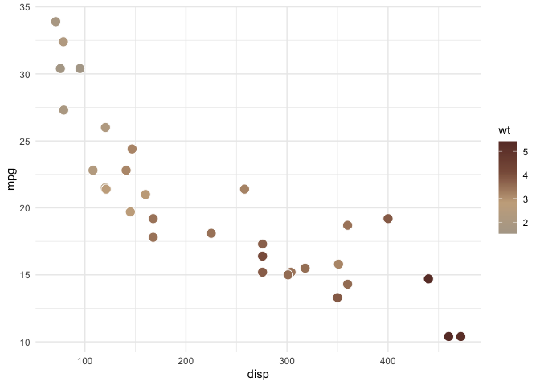
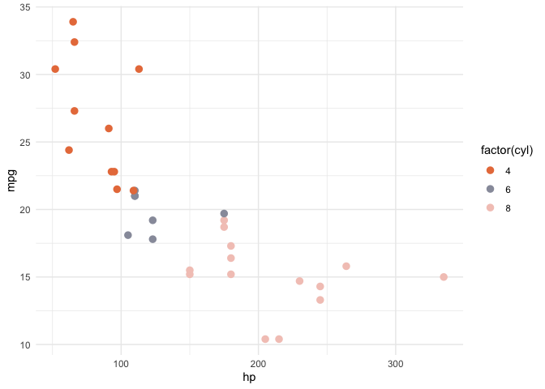

<!-- README.md is generated from README.Rmd. Please edit that file -->

# Package munchcolors

<!-- badges: start -->
<!-- badges: end -->

munchcolors provides a series of color palettes based on paintings by
Edvard Munch (1863 – 1944), a Norwegian painter most famous for “The
Scream”. Read more about Munch on
[Wikipedia](https://en.wikipedia.org/wiki/Edvard_Munch).

Color palettes are based on photos taken by the author at Norway’s
[National Museum](https://www.nasjonalmuseet.no/en/) and the [Munch
Museum](https://www.munchmuseet.no/en/), both in Oslo, Norway.

The palettes are designed to be used with continuous (quantitative) data
with single or diverging series or qualitative data.

Diverging continuous palette options and number of unique colors:

-   SelfPortrait1 (11)
-   SelfPortrait2 (7)
-   Scream1 (8)
-   Scream2 (6)
-   NewSnow1 (8)
-   NewSnow2 (6)

Single continuous palette options and number of unique colors:

-   NewSnowWarm (4)
-   NewSnowCool (4)

Qualitative palette options and number of unique colors:

-   Nietzsche (8)
-   Murderer (8)
-   YellowLog (7)
-   StarryNight1 (8) with single emphasis color (position 1)
-   StarryNight2 (7)

Most palettes are colorblind friendly and are able to be rendered into
gray scale without losing readability. However, consider limiting the
number of factors in qualitative palettes if gray scale is critically
important.

## Installation

You can install the development version of munchcolors from
[GitHub](https://github.com/) with:

``` r
# install.packages("devtools")
devtools::install_github("lindsaywaldrop/munchcolors")
```

## Using the Munch color palettes

The munch color palettes are stored in `munch_colors` object. Each
palette is a series of colors in hex format. For a list of options, see:

``` r
library(munchcolors)

names(munch_colors)
#>  [1] "SelfPortrait1" "SelfPortrait2" "Scream1"       "Scream2"      
#>  [5] "Nietzsche"     "Murderer"      "NewSnow1"      "NewSnow2"     
#>  [9] "NewSnowCool"   "NewSnowWarm"   "YellowLog"     "StarryNight1" 
#> [13] "StarryNight2"
```

You can generate palettes using `munch_palette()` function. The choice
argument should be from the above list of available palettes and n
should be the number of colors you wish to generate.

``` r
colors1 <- munch_palette(choice = "Scream1", n = 6)
colors1
#> [1] "#3C3C3C" "#68778B" "#95A1C3" "#F5B993" "#E5976D" "#BF7A6B"
```

The colors generated can be used like any other list of colors in a base
plot.

``` r
plot(mtcars$cyl, mtcars$mpg, 
     col = colors1[mtcars$carb], pch = 16, cex = 1.5)
legend("topright", pch = rep(16, 6), col = colors1, 
       legend = levels(factor(mtcars$carb)), ncol = 6)
```



The package can also be used to generate colors for ggplots using either
`scale_color_munch()` or `scale_fill_munch()`.

``` r
library(ggplot2)

ggplot(mtcars, aes(disp, mpg, fill = wt)) + 
  geom_point(size = 4, shape = 21, color = "white") + 
  scale_fill_munch(choice = "NewSnowWarm") +
  theme_minimal()
```



If you wish to use a categorical variable, use the option
`discrete = TRUE`.

``` r
ggplot(mtcars, aes(hp, mpg, color=factor(cyl))) +
  geom_point(size = 3, shape = 16) + 
  scale_color_munch(choice = "StarryNight1", discrete = TRUE) +
  theme_minimal()
```


